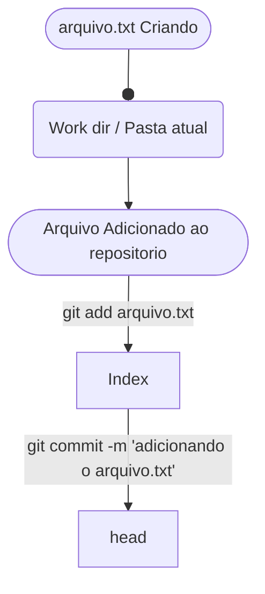

# Comandos Básicos para o uso do Git 


## configurações Globais

```sh
## Listar Configurações Globais
git config --global --list 
## Listar Configurações local
git config --list
## Configurar o nome do autor
git config --global user.name "Seu nome"
## Configurar o email do autor
git config --global user.email "exemplo@gmail.com"
## Configurar editor padrão do git
git config --global code.editor "vim"
## alterar nome da brach principal ao criar um repositorios 
git config --global init.defaultbranch "main"
```


### Iniciando Repositórios 
```sh
## Inicia um repositorio do git do tipo worktree
git init
## Inicia um repositorio do git do tipo bare
## Repositorios do tipo "bare" são 'puros', ou seja não poder receber arquivos que não sejam
## via git push, ficando como um servidor. 
git init --bare
```

### Verificando o Status do repositório 

```sh
## Mosta o estado atual do repositorio 
git status 
## Mosta o estado atual da Branch
git status main
```

### Clonando Repositórios 

```sh
# Clonar o repositorio criando uma pasta pasta com o nome do repositorio
git clone git@github.com:idpedro/cheat-sheets.git
# Clona o conteudo do repositorio para a pasta local  
git clone git@github.com:idpedro/cheat-sheets.git ./
```

## Fluxos de um arquivo no git 



### Adicionando o arquivo ao  monitoramento do git    

```sh
git add arquivo.txt
```

### Remover arquivo do monitoramento do git

```sh
git rm arquivo.txt
```

### Adicionado arquivo ao repositório  local

```sh
git commit -m "Adicionado meu arquvivo.txt" arquivo.txt
git commit -m "Adicionado meu arquvivo.txt"
```

### Adicionado repositório remoto 

```sh
## Adiciona o repositorio remoto na branch principal
git remote add https://github.com/idpedro/cheat-sheets
# Esse repositorio também poderia ser uma pasta compartilhada que fosse um
# repositorio git bare
git remote add /pasta/compartilhada 
```

### Enviar arquivos  para o repositório remoto

```sh
git push 
```

### Baixar arquivos do repositorio remoto

```sh
git pull 
```


### Verificar Logs do Git

```sh
## Mostra todos os logs do repositório
git log 
## Mostra os 5 ultimos logs do repositório
git log -5
## Mostra todos os  logs de um determinado autor 
# (Case Sesitive / Diferencia maiusculas de menusculas )
git log  --author "Pedro Ferreira"
## Mostra todos os logs resumindo a infomação para uma linha cada
git log --oneline
## Mostra todos os logs da branch main
git log main
## Mostra todos os logs de forma mais "grafica" no terminal
git log --graph --decorate
```

